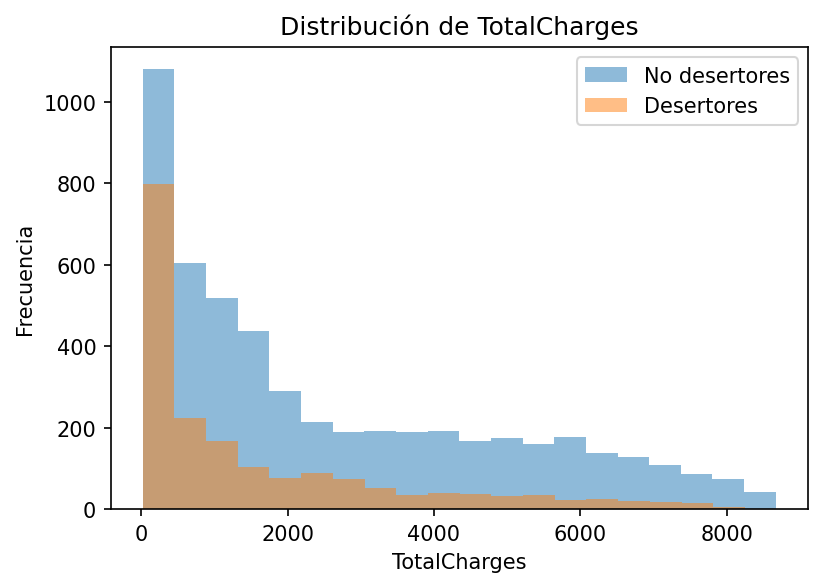
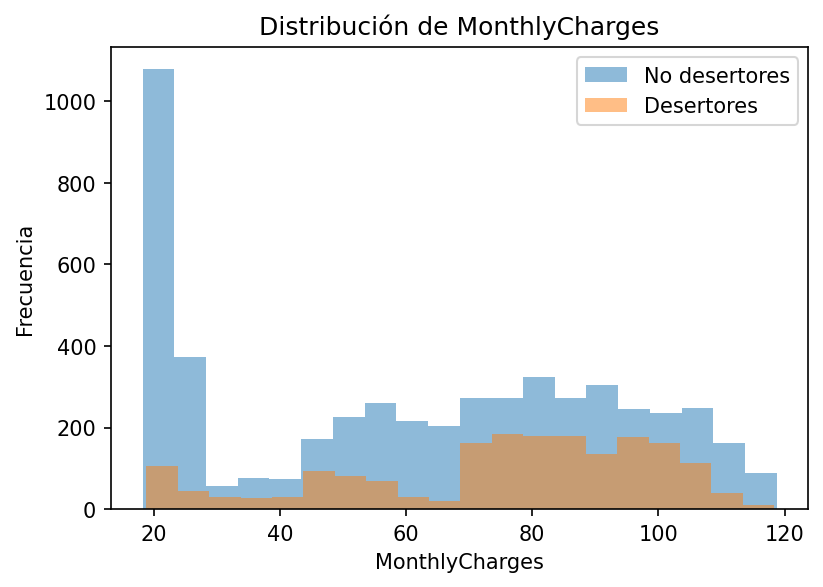
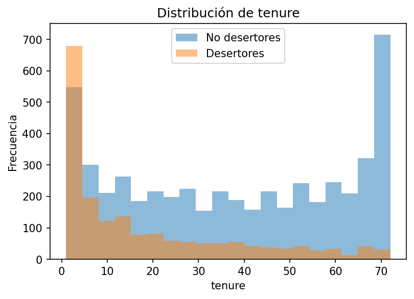
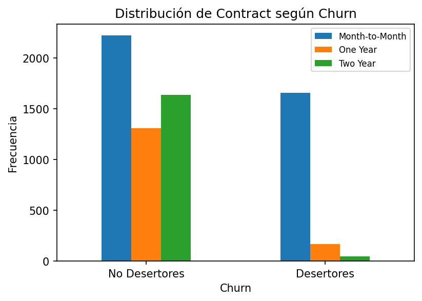
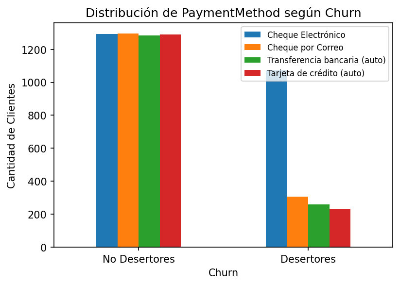
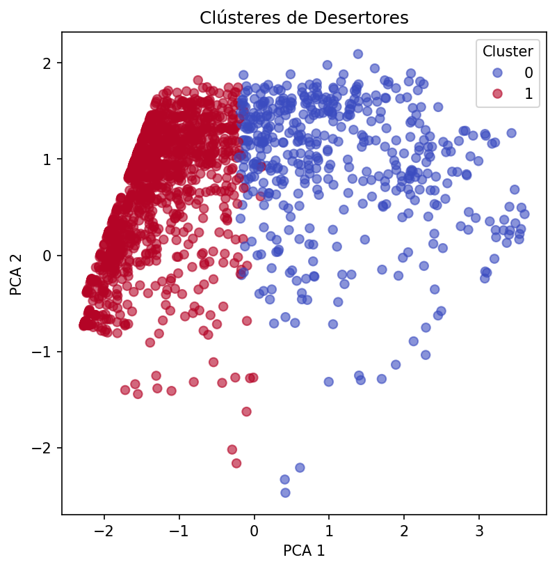
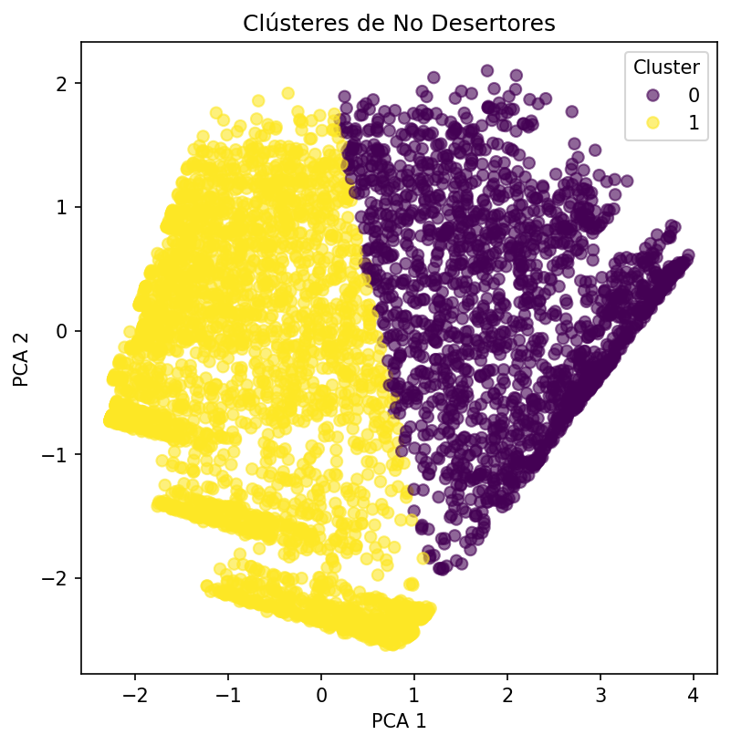
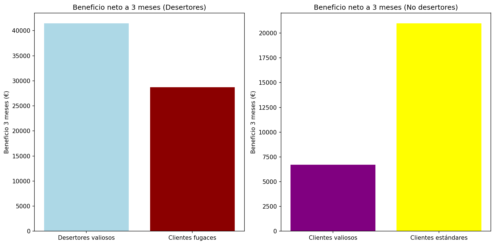

# Trabajo Final: Proyecto Movistar

## Aplicaciones y Casos de Uso Empresarial

### Máster Universitario en Tecnologías de Análisis de Datos Masivos: Big Data

**Alumno / DNI: Alejandro Pérez Belando /  48744603J**

## Enunciado

Movistar está preocupada por el aterrizaje de Netflix y por la oferta de Vodafone. Teme que algunos de sus clientes que tienen contratado MovistarPlus se vean atraídos por la nueva oferta de Vodafone. Os plantea la realización del diseño de una campaña de incentivos para mantener el mayor número de clientes en su empresa. En concreto os piden:

1. **Análisis de perfiles de posibles desertores**: Os piden que determinéis un perfil del posible desertor y también un perfil para aquel que no lo sea. La empresa os proporciona un dataset con un histórico de clientes que han dejado la empresa y los que no. A partir de él tenéis que identificar el perfil o perfiles de los que han dejado la empresa para prever los que tienen una alta probabilidad de solicitar portabilidades a Vodafone. Los perfiles tienen que identificar los atributos relevantes y los valores para dichos atributos.

2. **Segmentación/creación de grupos entre los desertores y los no desertores**: Os piden también agrupar los usuarios dentro de cada clase en función de sus atributos más relevantes. Esta segmentación será clave para diseñar la campaña de incentivos.

3. **Diseño de la campaña de incentivos**: Hay que identificar qué incentivos se ofrecen a cada grupo. Para ello habrá que estimar el valor estimado derivado de la realización de la campaña en cada uno de los grupos de interés y simular resultados de estas campañas.

La empresa pone a disposición un dataset sobre deserciones: `Telco customer churn.xls`.

## 1. Análisis de perfiles desertores 

Hay que identificar perfiles de posibles desertores y de personas fiables para la empresa. Estos perfiles deben tener identificados los atributos relevantes y valores para dichos atributos.

-------------------------------------


```python
# Librerías y dependencias necesarias para este apartado

import pandas as pd
import numpy as np
import matplotlib.pyplot as plt
import os
from sklearn.preprocessing import LabelEncoder
from sklearn.tree import DecisionTreeClassifier
from sklearn.model_selection import train_test_split
from sklearn.metrics import classification_report, confusion_matrix
```

Lo primero que voy a hacer es importar los datos y echarle un vistado a la estructura que tienen.


```python
df = pd.read_csv("Telco-Customer-Churn.csv") # Leer datos 

df.head() # Ver estructura de las primeras filas
```


<div>
<style scoped>
    .dataframe tbody tr th:only-of-type {
        vertical-align: middle;
    }

    .dataframe tbody tr th {
        vertical-align: top;
    }

    .dataframe thead th {
        text-align: right;
    }
</style>
<table border="1" class="dataframe">
  <thead>
    <tr style="text-align: right;">
      <th></th>
      <th>customerID</th>
      <th>gender</th>
      <th>SeniorCitizen</th>
      <th>Partner</th>
      <th>Dependents</th>
      <th>tenure</th>
      <th>PhoneService</th>
      <th>MultipleLines</th>
      <th>InternetService</th>
      <th>OnlineSecurity</th>
      <th>...</th>
      <th>DeviceProtection</th>
      <th>TechSupport</th>
      <th>StreamingTV</th>
      <th>StreamingMovies</th>
      <th>Contract</th>
      <th>PaperlessBilling</th>
      <th>PaymentMethod</th>
      <th>MonthlyCharges</th>
      <th>TotalCharges</th>
      <th>Churn</th>
    </tr>
  </thead>
  <tbody>
    <tr>
      <th>0</th>
      <td>7590-VHVEG</td>
      <td>Female</td>
      <td>0</td>
      <td>Yes</td>
      <td>No</td>
      <td>1</td>
      <td>No</td>
      <td>No phone service</td>
      <td>DSL</td>
      <td>No</td>
      <td>...</td>
      <td>No</td>
      <td>No</td>
      <td>No</td>
      <td>No</td>
      <td>Month-to-month</td>
      <td>Yes</td>
      <td>Electronic check</td>
      <td>29.85</td>
      <td>29.85</td>
      <td>No</td>
    </tr>
    <tr>
      <th>1</th>
      <td>5575-GNVDE</td>
      <td>Male</td>
      <td>0</td>
      <td>No</td>
      <td>No</td>
      <td>34</td>
      <td>Yes</td>
      <td>No</td>
      <td>DSL</td>
      <td>Yes</td>
      <td>...</td>
      <td>Yes</td>
      <td>No</td>
      <td>No</td>
      <td>No</td>
      <td>One year</td>
      <td>No</td>
      <td>Mailed check</td>
      <td>56.95</td>
      <td>1889.5</td>
      <td>No</td>
    </tr>
    <tr>
      <th>2</th>
      <td>3668-QPYBK</td>
      <td>Male</td>
      <td>0</td>
      <td>No</td>
      <td>No</td>
      <td>2</td>
      <td>Yes</td>
      <td>No</td>
      <td>DSL</td>
      <td>Yes</td>
      <td>...</td>
      <td>No</td>
      <td>No</td>
      <td>No</td>
      <td>No</td>
      <td>Month-to-month</td>
      <td>Yes</td>
      <td>Mailed check</td>
      <td>53.85</td>
      <td>108.15</td>
      <td>Yes</td>
    </tr>
    <tr>
      <th>3</th>
      <td>7795-CFOCW</td>
      <td>Male</td>
      <td>0</td>
      <td>No</td>
      <td>No</td>
      <td>45</td>
      <td>No</td>
      <td>No phone service</td>
      <td>DSL</td>
      <td>Yes</td>
      <td>...</td>
      <td>Yes</td>
      <td>Yes</td>
      <td>No</td>
      <td>No</td>
      <td>One year</td>
      <td>No</td>
      <td>Bank transfer (automatic)</td>
      <td>42.30</td>
      <td>1840.75</td>
      <td>No</td>
    </tr>
    <tr>
      <th>4</th>
      <td>9237-HQITU</td>
      <td>Female</td>
      <td>0</td>
      <td>No</td>
      <td>No</td>
      <td>2</td>
      <td>Yes</td>
      <td>No</td>
      <td>Fiber optic</td>
      <td>No</td>
      <td>...</td>
      <td>No</td>
      <td>No</td>
      <td>No</td>
      <td>No</td>
      <td>Month-to-month</td>
      <td>Yes</td>
      <td>Electronic check</td>
      <td>70.70</td>
      <td>151.65</td>
      <td>Yes</td>
    </tr>
  </tbody>
</table>
<p>5 rows × 21 columns</p>
</div>


```python
df.info() # Para ver cuántas filas, variables y tipos de datos 
```

    <class 'pandas.core.frame.DataFrame'>
    RangeIndex: 7043 entries, 0 to 7042
    Data columns (total 21 columns):
     #   Column            Non-Null Count  Dtype  
    ---  ------            --------------  -----  
     0   customerID        7043 non-null   object 
     1   gender            7043 non-null   object 
     2   SeniorCitizen     7043 non-null   int64  
     3   Partner           7043 non-null   object 
     4   Dependents        7043 non-null   object 
     5   tenure            7043 non-null   int64  
     6   PhoneService      7043 non-null   object 
     7   MultipleLines     7043 non-null   object 
     8   InternetService   7043 non-null   object 
     9   OnlineSecurity    7043 non-null   object 
     10  OnlineBackup      7043 non-null   object 
     11  DeviceProtection  7043 non-null   object 
     12  TechSupport       7043 non-null   object 
     13  StreamingTV       7043 non-null   object 
     14  StreamingMovies   7043 non-null   object 
     15  Contract          7043 non-null   object 
     16  PaperlessBilling  7043 non-null   object 
     17  PaymentMethod     7043 non-null   object 
     18  MonthlyCharges    7043 non-null   float64
     19  TotalCharges      7043 non-null   object 
     20  Churn             7043 non-null   object 
    dtypes: float64(1), int64(2), object(18)
    memory usage: 1.1+ MB
    

Realizo una copia del dataframe original para poder echarle un vistazo a la estructura origial si fuese necesario. Además, elimino la variable `CustomerID` ya que no es relevante al análisis.


```python
df_copia = df.copy()

df = df.drop(columns = ['customerID'])

```

Parece ser, a priori, que no hay ninguna variable que contengan datos nulos, por lo que no hay que eliminar ninguna fila por el momento.

La variable objetivo es `Churn`, que indica si el usuario ha abandonado la compañçia o no. (`Churn` = `No` --> No ha desertado y `Churn` = `Yes` --> Ha desertado)

Voy a ver cuántos valores únicos pueden tener cada una de las variables predictoras.


```python
for col in df.columns:
    print(col, "->", df[col].nunique(), "valores únicos ")
```

    gender -> 2 valores únicos 
    SeniorCitizen -> 2 valores únicos 
    Partner -> 2 valores únicos 
    Dependents -> 2 valores únicos 
    tenure -> 73 valores únicos 
    PhoneService -> 2 valores únicos 
    MultipleLines -> 3 valores únicos 
    InternetService -> 3 valores únicos 
    OnlineSecurity -> 3 valores únicos 
    OnlineBackup -> 3 valores únicos 
    DeviceProtection -> 3 valores únicos 
    TechSupport -> 3 valores únicos 
    StreamingTV -> 3 valores únicos 
    StreamingMovies -> 3 valores únicos 
    Contract -> 3 valores únicos 
    PaperlessBilling -> 2 valores únicos 
    PaymentMethod -> 4 valores únicos 
    MonthlyCharges -> 1585 valores únicos 
    TotalCharges -> 6531 valores únicos 
    Churn -> 2 valores únicos 
    

Ahora veo cuáles son esos valores. Para poder ver qué variables son más relevantes, debo codificarlas. Para hacer esto, tengo a priori dos opciones: 

  - Label Encoder: codifica de manera ordinal, es útil cuando las variables son binarias (solo pueden tomar dos valores) o los valores que pueden tomar siguen un orden claro.

  - One-Hot Encoder: codifica las variables convirtiendo cada valor de la variable original en una nueva variable (columna) binaria (`1` si se da esa característica, `0` si no). Es útil cuando los valores de la variable original no tienen nada que ver unos con otros y no se puede codifcar de manera ordinal.


```python
# Quiero ver los valores de todas las variables excepto aquellas que son numéricas y/o
# tienen muchos valores únicos
variables_excluidas = [ 'tenure', 'MonthlyCharges', 'TotalCharges']
for col in df.columns:
    if col not in variables_excluidas:
        print(df[col].value_counts())
        print("-"*20)
```

    gender
    Male      3555
    Female    3488
    Name: count, dtype: int64
    --------------------
    SeniorCitizen
    0    5901
    1    1142
    Name: count, dtype: int64
    --------------------
    Partner
    No     3641
    Yes    3402
    Name: count, dtype: int64
    --------------------
    Dependents
    No     4933
    Yes    2110
    Name: count, dtype: int64
    --------------------
    PhoneService
    Yes    6361
    No      682
    Name: count, dtype: int64
    --------------------
    MultipleLines
    No                  3390
    Yes                 2971
    No phone service     682
    Name: count, dtype: int64
    --------------------
    InternetService
    Fiber optic    3096
    DSL            2421
    No             1526
    Name: count, dtype: int64
    --------------------
    OnlineSecurity
    No                     3498
    Yes                    2019
    No internet service    1526
    Name: count, dtype: int64
    --------------------
    OnlineBackup
    No                     3088
    Yes                    2429
    No internet service    1526
    Name: count, dtype: int64
    --------------------
    DeviceProtection
    No                     3095
    Yes                    2422
    No internet service    1526
    Name: count, dtype: int64
    --------------------
    TechSupport
    No                     3473
    Yes                    2044
    No internet service    1526
    Name: count, dtype: int64
    --------------------
    StreamingTV
    No                     2810
    Yes                    2707
    No internet service    1526
    Name: count, dtype: int64
    --------------------
    StreamingMovies
    No                     2785
    Yes                    2732
    No internet service    1526
    Name: count, dtype: int64
    --------------------
    Contract
    Month-to-month    3875
    Two year          1695
    One year          1473
    Name: count, dtype: int64
    --------------------
    PaperlessBilling
    Yes    4171
    No     2872
    Name: count, dtype: int64
    --------------------
    PaymentMethod
    Electronic check             2365
    Mailed check                 1612
    Bank transfer (automatic)    1544
    Credit card (automatic)      1522
    Name: count, dtype: int64
    --------------------
    Churn
    No     5174
    Yes    1869
    Name: count, dtype: int64
    --------------------
    

Como resumen, las variables, sus valores y el tipo de codificación que deben llevar son: 

|  **Variable** | **Valores** | **Encoder**      | 
|---------------|-------------|------------------|
|    gender     | Male/Female | Label            |
| SeniorCitizen | 0/1         | Label            |
| Partner       | No/Yes      | Label            | 
| Dependents    | No/Yes      | Label            |
| PhoneService  | No/Yes      | Label            |
| MultipleLines | No/Yes/No phone service  | One-Hot  |
| InternetService | No/Fiber optic/DSL  | One-Hot  |
| OnlineSecurity | No/Yes/No internet service  | One-Hot  |
| OnlineBackup | No/Yes/No internet service  | One-Hot  |
| DeviceProtection | No/Yes/No internet service  | One-Hot  |
| TechSupport | No/Yes/No internet service  | One-Hot  |
| StreamingTV | No/Yes/No internet service  | One-Hot  |
| StreamingMovies | No/Yes/No internet service  | One-Hot  |
| Contract | Month-to-month/One year/Two year  | Label |
| PaperlessBilling | No/Yes  | Label  |
| PaymentMetod | Electronic check/Mailed check/Bank transfer(auto)/Credit card(auto)  | One-Hot  |
| Churn | No/Yes  | Label  |

Paso la variable `TotalCharges` a numérica (float) ya que es una cuenta total del dinero que ha pagado cada usuario durante el tiempo que ha estado, o está, en la compañía.


```python
df['TotalCharges'] = pd.to_numeric(df['TotalCharges'], errors='coerce')

df.info()
```

    <class 'pandas.core.frame.DataFrame'>
    RangeIndex: 7043 entries, 0 to 7042
    Data columns (total 20 columns):
     #   Column            Non-Null Count  Dtype  
    ---  ------            --------------  -----  
     0   gender            7043 non-null   object 
     1   SeniorCitizen     7043 non-null   int64  
     2   Partner           7043 non-null   object 
     3   Dependents        7043 non-null   object 
     4   tenure            7043 non-null   int64  
     5   PhoneService      7043 non-null   object 
     6   MultipleLines     7043 non-null   object 
     7   InternetService   7043 non-null   object 
     8   OnlineSecurity    7043 non-null   object 
     9   OnlineBackup      7043 non-null   object 
     10  DeviceProtection  7043 non-null   object 
     11  TechSupport       7043 non-null   object 
     12  StreamingTV       7043 non-null   object 
     13  StreamingMovies   7043 non-null   object 
     14  Contract          7043 non-null   object 
     15  PaperlessBilling  7043 non-null   object 
     16  PaymentMethod     7043 non-null   object 
     17  MonthlyCharges    7043 non-null   float64
     18  TotalCharges      7032 non-null   float64
     19  Churn             7043 non-null   object 
    dtypes: float64(2), int64(2), object(16)
    memory usage: 1.1+ MB
    

Como vemos, ahora en la variable `TotalCharges` hay 11 valores Null, por lo que voy a eliminar directamente esas filas, ya que son pocas y no me van a cambiar el resultado de este trabajo.


```python
# Elimilo las filas que tienen valores nulos
df.dropna(inplace = True)

df.info()
```

    <class 'pandas.core.frame.DataFrame'>
    Index: 7032 entries, 0 to 7042
    Data columns (total 20 columns):
     #   Column            Non-Null Count  Dtype  
    ---  ------            --------------  -----  
     0   gender            7032 non-null   object 
     1   SeniorCitizen     7032 non-null   int64  
     2   Partner           7032 non-null   object 
     3   Dependents        7032 non-null   object 
     4   tenure            7032 non-null   int64  
     5   PhoneService      7032 non-null   object 
     6   MultipleLines     7032 non-null   object 
     7   InternetService   7032 non-null   object 
     8   OnlineSecurity    7032 non-null   object 
     9   OnlineBackup      7032 non-null   object 
     10  DeviceProtection  7032 non-null   object 
     11  TechSupport       7032 non-null   object 
     12  StreamingTV       7032 non-null   object 
     13  StreamingMovies   7032 non-null   object 
     14  Contract          7032 non-null   object 
     15  PaperlessBilling  7032 non-null   object 
     16  PaymentMethod     7032 non-null   object 
     17  MonthlyCharges    7032 non-null   float64
     18  TotalCharges      7032 non-null   float64
     19  Churn             7032 non-null   object 
    dtypes: float64(2), int64(2), object(16)
    memory usage: 1.1+ MB
    

Convierto la variable `SeniorCitizen` a categórico para dejarlo en el mismo formato que el resto de las variables


```python
df['SeniorCitizen'] = df['SeniorCitizen'].apply(lambda x: 'Yes' if x == 1 else 'No')

df.info() # Y compruebo
```

    <class 'pandas.core.frame.DataFrame'>
    Index: 7032 entries, 0 to 7042
    Data columns (total 20 columns):
     #   Column            Non-Null Count  Dtype  
    ---  ------            --------------  -----  
     0   gender            7032 non-null   object 
     1   SeniorCitizen     7032 non-null   object 
     2   Partner           7032 non-null   object 
     3   Dependents        7032 non-null   object 
     4   tenure            7032 non-null   int64  
     5   PhoneService      7032 non-null   object 
     6   MultipleLines     7032 non-null   object 
     7   InternetService   7032 non-null   object 
     8   OnlineSecurity    7032 non-null   object 
     9   OnlineBackup      7032 non-null   object 
     10  DeviceProtection  7032 non-null   object 
     11  TechSupport       7032 non-null   object 
     12  StreamingTV       7032 non-null   object 
     13  StreamingMovies   7032 non-null   object 
     14  Contract          7032 non-null   object 
     15  PaperlessBilling  7032 non-null   object 
     16  PaymentMethod     7032 non-null   object 
     17  MonthlyCharges    7032 non-null   float64
     18  TotalCharges      7032 non-null   float64
     19  Churn             7032 non-null   object 
    dtypes: float64(2), int64(1), object(17)
    memory usage: 1.1+ MB
    

Ahora procedo a codiicar las variables de la forma en que se ha espeificado en la tabla anteriormente mostrada.


```python
# Codificación One-Hot
one_hot = ['MultipleLines', 'InternetService', 'OnlineSecurity', 'OnlineBackup', 'DeviceProtection',
           'TechSupport', 'StreamingTV', 'StreamingMovies', 'PaymentMethod']

df = pd.get_dummies(df, columns = one_hot, drop_first = False)

# Label Encoder
label = ['gender', 'SeniorCitizen', 'Partner', 'Dependents', 'PhoneService',
         'PaperlessBilling', 'Contract', 'Churn']

for col in label:
    df[col] = LabelEncoder().fit_transform(df[col])

df.info()
```

    <class 'pandas.core.frame.DataFrame'>
    Index: 7032 entries, 0 to 7042
    Data columns (total 39 columns):
     #   Column                                   Non-Null Count  Dtype  
    ---  ------                                   --------------  -----  
     0   gender                                   7032 non-null   int64  
     1   SeniorCitizen                            7032 non-null   int64  
     2   Partner                                  7032 non-null   int64  
     3   Dependents                               7032 non-null   int64  
     4   tenure                                   7032 non-null   int64  
     5   PhoneService                             7032 non-null   int64  
     6   Contract                                 7032 non-null   int64  
     7   PaperlessBilling                         7032 non-null   int64  
     8   MonthlyCharges                           7032 non-null   float64
     9   TotalCharges                             7032 non-null   float64
     10  Churn                                    7032 non-null   int64  
     11  MultipleLines_No                         7032 non-null   bool   
     12  MultipleLines_No phone service           7032 non-null   bool   
     13  MultipleLines_Yes                        7032 non-null   bool   
     14  InternetService_DSL                      7032 non-null   bool   
     15  InternetService_Fiber optic              7032 non-null   bool   
     16  InternetService_No                       7032 non-null   bool   
     17  OnlineSecurity_No                        7032 non-null   bool   
     18  OnlineSecurity_No internet service       7032 non-null   bool   
     19  OnlineSecurity_Yes                       7032 non-null   bool   
     20  OnlineBackup_No                          7032 non-null   bool   
     21  OnlineBackup_No internet service         7032 non-null   bool   
     22  OnlineBackup_Yes                         7032 non-null   bool   
     23  DeviceProtection_No                      7032 non-null   bool   
     24  DeviceProtection_No internet service     7032 non-null   bool   
     25  DeviceProtection_Yes                     7032 non-null   bool   
     26  TechSupport_No                           7032 non-null   bool   
     27  TechSupport_No internet service          7032 non-null   bool   
     28  TechSupport_Yes                          7032 non-null   bool   
     29  StreamingTV_No                           7032 non-null   bool   
     30  StreamingTV_No internet service          7032 non-null   bool   
     31  StreamingTV_Yes                          7032 non-null   bool   
     32  StreamingMovies_No                       7032 non-null   bool   
     33  StreamingMovies_No internet service      7032 non-null   bool   
     34  StreamingMovies_Yes                      7032 non-null   bool   
     35  PaymentMethod_Bank transfer (automatic)  7032 non-null   bool   
     36  PaymentMethod_Credit card (automatic)    7032 non-null   bool   
     37  PaymentMethod_Electronic check           7032 non-null   bool   
     38  PaymentMethod_Mailed check               7032 non-null   bool   
    dtypes: bool(28), float64(2), int64(9)
    memory usage: 851.5 KB
    

Ahora, tengo 39 variables cuando antes tenía 20, ya que la codificación One-Hot ha creado 'nuevas variables' binarias. 

La variable `Churn` se ha codificado de la forma: `Churn` = 0 -> No desertor y `Churn` = 1 -> Desertor


Lo que voy a hacer es un clasificador de árbol de decisión para extraaer la importancia de cada uno de los atributos en la predicción de la bariable objetivo (`Churn`)


```python
x = df.drop(['Churn'], axis=1) # Variables predictoras (odas menos Churn)
y = df['Churn'] # Churn (variable objetivo)

# lasificador
model = DecisionTreeClassifier(random_state = 1)
model.fit(x, y)

# Extraer importancia de características, con índice en los nombres de cada variable
importancias = pd.Series(model.feature_importances_, index = x.columns) 
# Y los ordeno de mayor importancia a menor
importancias = importancias.sort_values(ascending = False)

# Las muestro en orden 
print("Relevancia de las variables descendentemente")
print(importancias)
```

    Relevancia de las variables descendentemente
    MonthlyCharges                             0.200150
    TotalCharges                               0.192155
    Contract                                   0.169300
    tenure                                     0.110636
    InternetService_Fiber optic                0.049394
    gender                                     0.023556
    Dependents                                 0.019262
    Partner                                    0.018887
    PaperlessBilling                           0.018676
    TechSupport_No                             0.016715
    PaymentMethod_Electronic check             0.016045
    PaymentMethod_Mailed check                 0.015988
    SeniorCitizen                              0.015018
    PaymentMethod_Bank transfer (automatic)    0.012370
    OnlineSecurity_No                          0.011641
    OnlineBackup_Yes                           0.010749
    PaymentMethod_Credit card (automatic)      0.010388
    TechSupport_Yes                            0.010307
    MultipleLines_No                           0.009993
    DeviceProtection_No                        0.009982
    OnlineBackup_No                            0.008070
    DeviceProtection_Yes                       0.007605
    StreamingTV_Yes                            0.007366
    StreamingMovies_No                         0.006767
    OnlineSecurity_Yes                         0.006668
    StreamingMovies_Yes                        0.005962
    StreamingTV_No                             0.005435
    MultipleLines_Yes                          0.005402
    MultipleLines_No phone service             0.004008
    PhoneService                               0.001503
    OnlineBackup_No internet service           0.000000
    OnlineSecurity_No internet service         0.000000
    InternetService_No                         0.000000
    InternetService_DSL                        0.000000
    StreamingTV_No internet service            0.000000
    TechSupport_No internet service            0.000000
    DeviceProtection_No internet service       0.000000
    StreamingMovies_No internet service        0.000000
    dtype: float64
    

Clramente, se ve cómo las cuatro variales más importantes son `MonthlyCharges`, `TotalCharges`, `Contract` y `tenure`, que suman alrededor del 70% de la importancia. Sin embargo, yo quiero recoger algo más de información, por lo que voy a usar las 5 variables con más importancia. 

Como hay muchas variables codificadas con One-Hot y las importancias están divididas, voy a sumar las importancias de cada componente de las variables originales para ver cuál es la quinta variable con más importancia dentro de este conjunto de variables. 


```python
# Diccionario para agrupar 'de nuevo' las variables tras la codificació One-Hot
variables_agrupadas = {
    'InternetService': ['InternetService_Fiber optic', 'InternetService_No', 'InternetService_DSL'],
    'PaymentMethod': ['PaymentMethod_Electronic check', 'PaymentMethod_Mailed check', 
                      'PaymentMethod_Bank transfer (automatic)', 'PaymentMethod_Credit card (automatic)'],
    'TechSupport': ['TechSupport_No', 'TechSupport_Yes', 'TechSupport_No internet service'],
    'OnlineSecurity': ['OnlineSecurity_No', 'OnlineSecurity_Yes', 'OnlineSecurity_No internet service'],
    'OnlineBackup': ['OnlineBackup_No', 'OnlineBackup_Yes', 'OnlineBackup_No internet service'],
    'DeviceProtection': ['DeviceProtection_No', 'DeviceProtection_Yes', 'DeviceProtection_No internet service'],
    'StreamingTV': ['StreamingTV_No', 'StreamingTV_Yes', 'StreamingTV_No internet service'],
    'StreamingMovies': ['StreamingMovies_No', 'StreamingMovies_Yes', 'StreamingMovies_No internet service'],
    'MultipleLines': ['MultipleLines_No', 'MultipleLines_Yes', 'MultipleLines_No phone service']
}

# Sumar la importancia de las columnas relacionadas
importancias_totales = {} # Diccionario para guardar las importancias agrupadas
for grupo, col in variables_agrupadas.items():
    importancias_totales[grupo] = importancias[col].sum()

# De diccionario a Datafame
importancias_totales = pd.DataFrame.from_dict(importancias_totales, orient='index', columns = ['Importancia'])
# Ordenando de más a menos importante
importancias_totales = importancias_totales.sort_values(by = 'Importancia', ascending=False)

print(importancias_totales)
```

                      Importancia
    PaymentMethod        0.054791
    InternetService      0.049394
    TechSupport          0.027022
    MultipleLines        0.019403
    OnlineBackup         0.018819
    OnlineSecurity       0.018310
    DeviceProtection     0.017587
    StreamingTV          0.012801
    StreamingMovies      0.012729
    

Se puede ver entonces que la siguiente vaiable más importante es `PaymentMethod`, por lo que mis cinco variables seleccionadas va a ser: 

- `MonthlyCharges`: cuota mensual que el usuario está pagando en este momento (en el caso de los no desertores), o la última cuota mensual que el uuario ha pagado (en el caso de los desertores).
- `TotalCharges`: dinero total pagas por el usuario en los meses que ha estado (o está) en la compañía.
- `Contract`: tipo de plan contratado, puede ser mensual, anual o bianual.
- `tenure`: meses que lleva el usuario siendo o ha sido cliente de la empresa.
- `PaymentMethod`: método de pago empleado, puede ser cheque electrónico, cheque enviado por correo, transferencia bancaria (auto) o pago con tarjeta de crédito (auto).

Estas variables suman aproximadamente el 75% de la importancia total.

<u>**Representaciones gráficas**</u>: voy a representar gráficamente estos atributos para poder entender mejor cómo se distribuye cada una de estas características dentro de los grupos de desertores y no desertores.


```python
# Lo primero, creo una carpeta nueva para guardar las gráficas y pder ponerlas luego en el archivo *.md
os.makedirs("figuras", exist_ok=True)
```


```python
# Primero veo las distribuciones de las variables que son originalmente numéricas
numericas = ['TotalCharges', 'MonthlyCharges', 'tenure']  

for i in numericas:
    plt.figure(figsize=(6, 4))
    for churn_value in [0, 1]:
        subset = df[df['Churn'] == churn_value]
        label = "No desertores" if churn_value == 0 else "Desertores"
        plt.hist(subset[i], bins=20, alpha=0.5, label=label)
    plt.title(f'Distribución de {i}')
    plt.xlabel(i)
    plt.ylabel('Frecuencia')
    plt.legend()

    # Guardo las imágenes
    plt.savefig(f"figuras/{i}.png", dpi=150, bbox_inches="tight")
    
    plt.show()
```


    

    


    

    


    

    


```python
# Gráfico de barras para Contract separado por desertores y no desertores

contract_agrupado = df.groupby(['Churn', 'Contract']).size().unstack()
contract_agrupado.plot(kind='bar', stacked=False, figsize=(6, 4))
plt.title('Distribución de Contract según Churn')
plt.ylabel('Frecuencia')
plt.legend(['Month-to-Month', 'One Year', 'Two Year'], fontsize=8)
plt.xticks(ticks=[0, 1], labels=['No Desertores', 'Desertores'], rotation = 0)

# Guardo 
plt.savefig(f"figuras/contract.png", dpi=150, bbox_inches="tight")

plt.show()
```


    

    


```python
# Gráfico de barras apilado para PaymentMethod
pago_agrupado = df.groupby(['Churn'])[variables_agrupadas['PaymentMethod']].sum()
pago_agrupado.plot(kind='bar', stacked=False, figsize=(6, 4))
plt.title('Distribución de PaymentMethod según Churn')
plt.ylabel('Cantidad de Clientes')

# Cambiar los nombres de las etiquetas manualmente
nombres_labels = ['Cheque Electrónico', 'Cheque por Correo', 'Transferencia bancaria (auto)', 'Tarjeta de crédito (auto)']
plt.legend(nombres_labels, fontsize=8)
plt.xticks(ticks=[0, 1], labels=['No Desertores', 'Desertores'], rotation = 0)

plt.savefig(f"figuras/payment.png", dpi=150, bbox_inches="tight")

plt.show()
```


    

    


<u>**Análisis de los atributos más relevantes**</u>: voy a analizar los valores de estos cinco atributos. Para los prineros cuatro (es decir, `MonthlyCharges`, `TotalCharges`, `Contract` y `tenure`), voy a calcular las medias de estos atributos dentro de cada grupo general (desertores y no desertores); y posteriormente para `PaymentMethod` voy a ver cómo se distribuyen las frecuencias de los posibles valores.


```python
# Seleccionando los 5 atributos más relevantes, veo las medias de cada uno para desertores y no desertores 
# Recuerdo: `Churn = 0` (no desertores) y `Churn = 1` (desertores)
cuatro_primeras = importancias.head(4).index.tolist()

# Comparar medias de atributos importantes
cuatro_agrupadas = df.groupby('Churn')[cuatro_primeras].mean()
print("Media de cada atributo por perfiles")
cuatro_agrupadas
```

    Media de cada atributo por perfiles
    


<div>
<style scoped>
    .dataframe tbody tr th:only-of-type {
        vertical-align: middle;
    }

    .dataframe tbody tr th {
        vertical-align: top;
    }

    .dataframe thead th {
        text-align: right;
    }
</style>
<table border="1" class="dataframe">
  <thead>
    <tr style="text-align: right;">
      <th></th>
      <th>MonthlyCharges</th>
      <th>TotalCharges</th>
      <th>Contract</th>
      <th>tenure</th>
    </tr>
    <tr>
      <th>Churn</th>
      <th></th>
      <th></th>
      <th></th>
      <th></th>
    </tr>
  </thead>
  <tbody>
    <tr>
      <th>0</th>
      <td>61.307408</td>
      <td>2555.344141</td>
      <td>0.887081</td>
      <td>37.650010</td>
    </tr>
    <tr>
      <th>1</th>
      <td>74.441332</td>
      <td>1531.796094</td>
      <td>0.140182</td>
      <td>17.979133</td>
    </tr>
  </tbody>
</table>
</div>


Analizando un poco más en profundidad la variable `Contract`


```python
# Los desertores son
df[df['Churn'] == 1]['Contract'].value_counts()
```


    Contract
    0    1655
    1     166
    2      48
    Name: count, dtype: int64


```python
# Y no desertores: 
df[df['Churn'] == 0]['Contract'].value_counts()
```


    Contract
    0    2220
    2    1637
    1    1306
    Name: count, dtype: int64


```python
# Y las proporciones de usuarios desertores y no desertores con cada tipo de contrato
contract_prop = df.groupby('Churn')['Contract'].value_counts(normalize = True).unstack()
print("Proporciones de `Contract` segón desertores y no desertores")
contract_prop

# Recuerdo: Churn = 0 --> No desertores, Churn = 1 --> Desertores
```

    Proporciones de `Contract` segón desertores y no desertores
    


<div>
<style scoped>
    .dataframe tbody tr th:only-of-type {
        vertical-align: middle;
    }

    .dataframe tbody tr th {
        vertical-align: top;
    }

    .dataframe thead th {
        text-align: right;
    }
</style>
<table border="1" class="dataframe">
  <thead>
    <tr style="text-align: right;">
      <th>Contract</th>
      <th>0</th>
      <th>1</th>
      <th>2</th>
    </tr>
    <tr>
      <th>Churn</th>
      <th></th>
      <th></th>
      <th></th>
    </tr>
  </thead>
  <tbody>
    <tr>
      <th>0</th>
      <td>0.429983</td>
      <td>0.252954</td>
      <td>0.317064</td>
    </tr>
    <tr>
      <th>1</th>
      <td>0.885500</td>
      <td>0.088818</td>
      <td>0.025682</td>
    </tr>
  </tbody>
</table>
</div>


Recogiendo toda esta información de la variable `Contract` en una tabla:

| **Antes de codificar** | **Después de codificar** |   **Desertores**  | **No Desertores** | **Total** | 
|------------------------|--------------------------|-------------------|-------------------|-----------|
|      Month-to-Month    |            0             |      1655 (88.55%)|     2220  (43.0%) |   3875    |
|      One year          |            1             |      166  (8.88%) |     1306  (25.3%) |   1472    |
|      Two year          |            2             |      48   (2.57%) |     1637  (31.7%) |   1685    |

Y haciendo lo mismo con la variable `PaymentMethod`


```python
# Valores en general
df_copia['PaymentMethod'].value_counts()
```


    PaymentMethod
    Electronic check             2365
    Mailed check                 1612
    Bank transfer (automatic)    1544
    Credit card (automatic)      1522
    Name: count, dtype: int64


```python
# Los desertores son
df_copia[df_copia['Churn'] == 'Yes']['PaymentMethod'].value_counts()
```


    PaymentMethod
    Electronic check             1071
    Mailed check                  308
    Bank transfer (automatic)     258
    Credit card (automatic)       232
    Name: count, dtype: int64


```python
# Y los no desertores:
df_copia[df_copia['Churn'] == 'No']['PaymentMethod'].value_counts()
```


    PaymentMethod
    Mailed check                 1304
    Electronic check             1294
    Credit card (automatic)      1290
    Bank transfer (automatic)    1286
    Name: count, dtype: int64


```python
# Pproporciones de usuarios desertores y no desertores con cada tipo de pago
pago_prop = df.groupby('Churn')[variables_agrupadas['PaymentMethod']].mean()

print("Proporciones de PaymentMethod según desertores y no desertores:")
pago_prop
```

    Proporciones de PaymentMethod según desertores y no desertores:
    


<div>
<style scoped>
    .dataframe tbody tr th:only-of-type {
        vertical-align: middle;
    }

    .dataframe tbody tr th {
        vertical-align: top;
    }

    .dataframe thead th {
        text-align: right;
    }
</style>
<table border="1" class="dataframe">
  <thead>
    <tr style="text-align: right;">
      <th></th>
      <th>PaymentMethod_Electronic check</th>
      <th>PaymentMethod_Mailed check</th>
      <th>PaymentMethod_Bank transfer (automatic)</th>
      <th>PaymentMethod_Credit card (automatic)</th>
    </tr>
    <tr>
      <th>Churn</th>
      <th></th>
      <th></th>
      <th></th>
      <th></th>
    </tr>
  </thead>
  <tbody>
    <tr>
      <th>0</th>
      <td>0.250629</td>
      <td>0.251017</td>
      <td>0.248693</td>
      <td>0.249661</td>
    </tr>
    <tr>
      <th>1</th>
      <td>0.573034</td>
      <td>0.164794</td>
      <td>0.138042</td>
      <td>0.124131</td>
    </tr>
  </tbody>
</table>
</div>


Recogiendo toda esta información de la variable `PaymentMethod` en una tabla:

| **Antes de codificar**       |   **Desertores**  | **No Desertores** | **Total** | 
|------------------------------|-------------------|-------------------|-----------|
|  Cheque electrónico          |      1071 (57.3%) |     1304  (25.1%) |   2365    |
|  Cheque por correo           |      308  (16.5%) |     1294  (25.1%) |   1612    |
| Transferencia bancaria (auto)|      258   (13.8%)|     1286  (24.8%) |   1544    |
| Tareta de crédito (auto)     |      232   (12.4%)|     1290  (25%)   |   1522    |

<u>**Conclusiones extraídas**</u>

A partir de realizar este análisis de cada atributo para desertores (`Churn = 1`) y no desertores (`Churn = 0`) podemos ver la siguiente información: 

<u>Promedio de los cargos totales (`TotalCharges`)</u>: 

  - Para los *no desertores* es de aproximadamente 2555.34 euros, mucho mayor que para los desertores.
  - Para los *desertores* de 1531.80 euros.

<u>Promedio de los cargos mensuales (`MonthlyCharges`)</u>: 
  
  - Para los *no desertores* es de aproximadamente 61.30 euros
  - Para los *desertores* de 74.44 euros, considerablemente mayor. 
  - Esto también tiene sentido, ya que normalmente los contratos con permanencia o a largo plazo suelen tener descuentos o promociones.

<u>Promedio del tipo de contrato (`Contract`)</u>: el estudio de esta variable se encuentra en la primera tabla hecha anteriormente.
  
  - Para los *no desertores*, este valor es de 0.887081. Como los valores de la variable han sido codificados anteriormente (a los valores `0`, `1` y `2`), esto quiere decir que los valores se acercan al valor `1` y puede llevar a pensar que hay una predominancia de los contratos de un año. 

    Sin embargo, al analizar los usuarios totales, vemos que realmente la categoría de cotrato más frecuentada es la mensual seguido de la de dos años y por último la anual. 
  - Para los *desertores*, por otro lado, este valor es de 0.140182. este valor se acerca mucho al 0 y al revisar los datos de la tabla anterior, efectivamente los contratos más solicitados son los mensuales, siendo los anuales muy poco comunes.

<u>Promedio de los meses de permanencia (`tenure`)</u>: 

  - Para los *no desertores* es de aproximadamente 37.6 meses.
  - Para los *desertores* de 18 meses, notablemente menor. 


<u>Tipo de pago (`PaymentMethod`)</u>: como en este caso no se ha realizado el promedio al estar la variable codificada con One-Hot, se analiza los resultados con el número total y las proporciones para cada uno de los grupos
  
  - Para los *no desertores*, hay una proporción casi perfectamente dividida entre las cuatro opciones que la compañía ofrece como método de pago. Es decir, no hay una opción que predomine sobre las demás en el perfil de los no desertores.
  - Para los *desertores*, por otro lado, se ve una clara dominancia de los usuarios que emplean como método de pago el cheque electróico. Dejando a un lado el cheque electróico, no destaca ninguna del resto de opciones.


<u>**Tabla resumen de los perfiles**</u>

Separación básica de los perfiles en función de los 5 atributos más relevantes:

| **Característica**           | **No desertores (`Churn = 0`)** | **Desertores (`Churn = 1`)** | **Notas**                                                                                                                                               |
|-------------------------------|---------------------------------------------|-----------------------------------------|-----------------------------------------------------------------------------------------------------------------------------------------------------------------|
| **Cargos Totales (`TotalCharges`)** | 2555.34 euros                          | 1531.80 euros                          | Los clientes que se mantienen generan más ingresos totales.                                                                               |
| **Cargos Mensuales (`MonthlyCharges`)** | 61.30 euros                           | 74.44 euros                            | Los desertores tienen cargos mensuales más altos.                                       |
| **Tipo de Contrato (`Contract`)** | Más mensuales pero también muchos a largo plazo | Predomina claramente los contratos mensuales | Los desertores no optan por contratos largos, mientras que más de la mitad de los no desertores, sí.                                   |
| **Meses de Permanencia (`tenure`)** | 37.6 meses                             | 18 meses                               | Los clientes que se mantienen tienen una permanencia significativamente mayor, es lógico.                           |
| **Tipo de pago (`PaymentMethod`)** | Proporciones bien divididas entre las categorías. | Predomina el método de pago con cheque electrónico | Los desertores suelen pagar con cheque electrónico, en los no desertores no hay tendencia.       


## 2. Segmentación/creación de grupos entre los desertores y los no desertores

Os piden también agrupar los usuarios dentro de cada clase en función de sus atributos más relevantes. Esta segmentación será clave para diseñar la campaña de incentivos.

--------------------------------------


Lo que se está pidiento en este ejercicio es que se haga un proceso de clústering (agrupamiento). Es decir, a partir de la relación entre los elementos, identificar distintos grupos de esos elementos:

 - Dentro de un grupo, los elementos deben ser similares entre sí.
 - Los elementos de un grupo deben ser distintos de los elementos de otros grupos. 

Este proceso de agrpación se hará distinguiendo previamente los desertores de los no desertores. Es decir, se agruparán los clientes dentro de los desertores y también se hará dentro de los no desertores.


```python
# Librerías necesarias para este ejercicio 

from sklearn.preprocessing import StandardScaler
from sklearn.cluster import KMeans
from sklearn.metrics import silhouette_score
from sklearn.decomposition import PCA
```

Lo primero que voy a hacer es escalar las variables, distinguiendo entre las variables que son numéricas (`MonthlyCharges`, `TotalCharges`, `Contract` y `tenure`) y la variable `PaymentMethod` que ha sido codificada usando One-Hot Encoder de forma que se han generado cuatro atributos binarios, uno para cada valor que podía tomar originalmente la variable.

>Nota: se puede pensar que la variable `Contract` no debería escalarse porque se ha codificado usando LabelEncoder y toma los valores 0, 1 y 2. Sin embargo, es correcto escalarla ya que estos valores siguen un orden tras la codificación.

El escalado se usa para estanzarizar las variables (es decir, hacer que cada variable tenga una media 0 y desviación estándar 1). No se escalan las variables codificadas con One-Hot porque son representaciones binarias.


```python
# Separo las variables numéricas de las codificadas con One-Hot
numericas2 = ['MonthlyCharges', 'TotalCharges', 'Contract', 'tenure']
payment = ['PaymentMethod_Electronic check', 'PaymentMethod_Mailed check', 
                   'PaymentMethod_Bank transfer (automatic)', 'PaymentMethod_Credit card (automatic)']

# Escalo solo las variables numéricas
df[numericas2] = StandardScaler().fit_transform(df[numericas2])

#Y separo los deserores y no desertores (todas las variables)
desertores = df[df['Churn'] == 1][numericas2 + payment].copy()
no_desertores = df[df['Churn'] == 0][numericas2 + payment].copy()
```

Como el objetivo de este apartado es dividir tanto a desertores como no desertores en grupos (clustering) y no sé cuántos grupos debo hacer, voy a tomar una malla de grupos (por ejemplo entre 2 y 6) y voy a aplicar el método *KMeans* para dividir los datos en cada uno de esos conjuntos de grupos y el *ídice silueta* para evaluar la calidad de cada agrupamiento y así decidir qué número de clústeres (grupos) debo hacer. 

- *KMeans*: dentro de los criterios globales para medir la coherencia de cada grpo y entre grupos, es el más popular para variables numéricas. Voy a dividir cada una de las dos agrupaciones hechas antes (desertores y no desertores) en 2, 3, 4, 5 y 6 clústeres. 
- *Índice silueta*: es una métrica que evalúa la calidad del agrupamiento, es decir, indica cómode cerca etánentre sí los elementos de un clúster (distancia intraclúster), y cómo de distintos son los clústeres entre sí (distancia interclúster). Este índice toma valores $[-1, 1]$ y cuanto más se acerque a 1, mejor.


```python
# Parámetros
k_min, k_max = 2, 7

# Para los desertores: 
silueta_desertores = [] # Inicio la lista vacía 
for k in range(k_min, k_max):
    kmeans = KMeans(n_clusters = k, random_state = 1, n_init = 'auto')
    etiquetas = kmeans.fit_predict(desertores) #Ajuste dek modelo a los datos 
    indice = silhouette_score(desertores, etiquetas) # Cálculo del índice
    silueta_desertores.append(indice) # Añade indice a la lista
    print("k = ", k, "--> Indice silueta = ", indice)

# Ahora extraigo el valor óptimo (cuando el índice silueta es máximo)
k_desertores = range(k_min, k_max)[np.argmax(silueta_desertores)]
print("k óptimo (desertores) = ", k_desertores)
```

    k =  2 --> Indice silueta =  0.42383405928479856
    k =  3 --> Indice silueta =  0.33858225329673763
    k =  4 --> Indice silueta =  0.31415777547179197
    k =  5 --> Indice silueta =  0.324717437608992
    k =  6 --> Indice silueta =  0.3488287966529302
    k óptimo (desertores) =  2
    


```python
# Para los no desertores (proceso análogo): 
silueta_no_desertores = []
for k in range(k_min, k_max):
    kmeans2 = KMeans(n_clusters = k, random_state = 1, n_init = 'auto')
    etiquetas2 = kmeans2.fit_predict(no_desertores) 
    indice2 = silhouette_score(no_desertores, etiquetas2)
    silueta_no_desertores.append(indice2) 
    print("k = ", k, "--> Indice silueta = ", indice2)

k_no_desertores = range(k_min, k_max)[np.argmax(silueta_no_desertores)]
print("k óptimo (no desertores)= ", k_no_desertores)

```

    k =  2 --> Indice silueta =  0.3437888554189012
    k =  3 --> Indice silueta =  0.33251417904369834
    k =  4 --> Indice silueta =  0.2958527960016614
    k =  5 --> Indice silueta =  0.2697342534474452
    k =  6 --> Indice silueta =  0.2559396106028205
    k óptimo (no desertores)=  2
    

Por lo tanto,al hacer el proceso de clústering sobre los desertores y los no desertores, lo más óptimo es que se divida cada uno de estos dos en dos grupos. 

Por lo tanto, voy a realiar ese clústering con dos grupos tanto para desertores como no desertores


```python
# Aplicar Kmeans a desertores y no desertores
kmeans_desertores = KMeans(n_clusters = 2, random_state = 1)
kmeans_no_desertores = KMeans(n_clusters = 2, random_state = 1)

# Ajuste del modelo a los datos 
desertores_labels = kmeans_desertores.fit_predict(desertores)
no_desertores_labels = kmeans_no_desertores.fit_predict(no_desertores)

# Añadir etiquetas de cluster
desertores['Cluster'] = desertores_labels
no_desertores['Cluster'] = no_desertores_labels

```

Como en este punto los datos tienen muchas variables (8 ya que una de ellas se ha cosificado con One-Hot creando 4 nuevas), para poder visualizar este clústering es necesario realizar una técnica de reducción de dimensionalidad, como es la **PCA (análisis de componentes principales)**. 

El PCA se aplica para definir combinaciones lienales de los predictores, para su uso en la regresión. El primner componente principal es aquella combinación lineal normalizada de las variables con mayor varianza (información) de los datos originales. El segundo componente principal tiene la mayor varanza, sujeto a no estar correlacionado con el primero.


```python
# PCA sobre todo el espacio
pca = PCA(n_components=2)
pca.fit(df[numericas2 + payment])

desertores_pca = pca.transform(desertores[numericas2 + payment])
no_desertores_pca = pca.transform(no_desertores[numericas2 + payment])
```

Visualizo gráficamente los desertores y los no desertores


```python
# Desrrtores
plt.figure(figsize=(6,6))
sc = plt.scatter(desertores_pca[:,0], desertores_pca[:,1],
                 c = desertores_labels, cmap='coolwarm', alpha=0.6)
plt.title('Clústeres de Desertores')
plt.xlabel('PCA 1')
plt.ylabel('PCA 2')
# Aádo la leyenda para saber cuál es cada clúster
plt.legend(*sc.legend_elements(), title='Cluster')

#Guardo
plt.savefig(f"figuras/desertores.png", dpi=150, bbox_inches="tight")

plt.show()
```


    

    


```python
# No desertores
plt.figure(figsize=(6,6))
sc2 = plt.scatter(no_desertores_pca[:,0], no_desertores_pca[:,1],
                  c=no_desertores_labels, alpha=0.6)
plt.title('Clústeres de No Desertores')
plt.xlabel('PCA 1')
plt.ylabel('PCA 2')
plt.legend(*sc2.legend_elements(), title='Cluster')

#Guardo
plt.savefig(f"figuras/no_desertores.png", dpi=150, bbox_inches="tight")

plt.show()
```


    

    


Interesa saber además, cuántos clientes hay en cada clúster dentro de los desertores y los no desertores


```python
# Desertores 
counts_des = desertores['Cluster'].value_counts().sort_index()
props_des = desertores['Cluster'].value_counts(normalize=True).sort_index() * 100

print("Número de desertores por clúster")
print(counts_des)
print("-"*20)
print("Proporciones")
print(props_des.round(2))
```

    Número de desertores por clúster
    Cluster
    0     466
    1    1403
    Name: count, dtype: int64
    --------------------
    Proporciones
    Cluster
    0    24.93
    1    75.07
    Name: proportion, dtype: float64
    


```python
# No desertores
counts_no = no_desertores['Cluster'].value_counts().sort_index()
props_no = no_desertores['Cluster'].value_counts(normalize=True).sort_index() * 100

print("Número de no desertores por clúster")
print(counts_no)
print("-"*20)
print("Proporciones")
print(props_no.round(2))
```

    Número de no desertores por clúster
    Cluster
    0    1861
    1    3302
    Name: count, dtype: int64
    --------------------
    Proporciones
    Cluster
    0    36.04
    1    63.96
    Name: proportion, dtype: float64
    

Podemos ver de esta forma que: 
  - Para los **desertores**, el 75% pertenecen al clúster marcado como `1` y el 25% restante al clúster marcado como `0`.
  - Para los **no desertores**, el 64% pertenecen al clúster marcado como `1` y el 25% restante al clúster marcado como `0`.

<u>**Perfilado de los clústeres**</u>: voy a analizar las características de cada clúster para ver qué les diferencia.


```python
# Para los desertores 

desertores_perfil = desertores.groupby('Cluster')[numericas2 + payment].mean()
# print(desertores_perfil)
desertores_perfil
```


<div>
<style scoped>
    .dataframe tbody tr th:only-of-type {
        vertical-align: middle;
    }

    .dataframe tbody tr th {
        vertical-align: top;
    }

    .dataframe thead th {
        text-align: right;
    }
</style>
<table border="1" class="dataframe">
  <thead>
    <tr style="text-align: right;">
      <th></th>
      <th>MonthlyCharges</th>
      <th>TotalCharges</th>
      <th>Contract</th>
      <th>tenure</th>
      <th>PaymentMethod_Electronic check</th>
      <th>PaymentMethod_Mailed check</th>
      <th>PaymentMethod_Bank transfer (automatic)</th>
      <th>PaymentMethod_Credit card (automatic)</th>
    </tr>
    <tr>
      <th>Cluster</th>
      <th></th>
      <th></th>
      <th></th>
      <th></th>
      <th></th>
      <th></th>
      <th></th>
      <th></th>
    </tr>
  </thead>
  <tbody>
    <tr>
      <th>0</th>
      <td>0.92989</td>
      <td>0.914105</td>
      <td>-0.254746</td>
      <td>0.586105</td>
      <td>0.521459</td>
      <td>0.049356</td>
      <td>0.212446</td>
      <td>0.216738</td>
    </tr>
    <tr>
      <th>1</th>
      <td>0.11815</td>
      <td>-0.745294</td>
      <td>-0.792504</td>
      <td>-0.978574</td>
      <td>0.590164</td>
      <td>0.203136</td>
      <td>0.113329</td>
      <td>0.093371</td>
    </tr>
  </tbody>
</table>
</div>


**Interpretación de los perfiles de los <u>desertores</u>**

Apuntes generales: 

  - Se identifican dos valores para `Cluster` (`0` y `1`), lo que significa que se han creado dos agrupamientos con características promedio distintas.
  - Las variables escaladas al inicio del apartado (`MonthlyCharges`, `TotalCharges`, `Contract` y `tenure`) tienen media 0 y desvicación estándar 1, por lo que los valores ppositivos están por encima de la media general y negativos que están por debajo.
  - La variable `PaymentMethod` que ha sido codificada con One-Hot representa proporciones en el clúster.

<u>Perfil de Cluster = 0</u>:  
  
  - `MonthlyCharges`: 0.92989 y `TotalCharges`: 0.914105 --> Los clientes de este clúster tienen cargos mensuales y totales muy por encima del promedio.
  - `Contract`: -0.254746 --> Al ser un valor negativo, predominan los contratos ligeramente por debajo de la media, por lo que predominan los contratos mensuales.
  - `tenure`: 0.586105 --> Los clientes de este clúster tienen una permanencia superior al primedio.
  - `PaymentMethod`: El cheque electrónico es el método más común con el 52%, aunque otros métodos como transferencia bancaria (21.2%) o tarjeta de crédito (21.6%) también se usan.


<u>Perfil de Cluster = 1</u>:  
  
  - `MonthlyCharges`: 0.11815 --> Los cargos mensuales están ligeramente por encima del promedio
  - `TotalCharges`: -0.745294 --> Los clientes de este clúster tienen cargos totales muy por debajo del promedio.
  - `Contract`: -0.792504 --> Los contratos en este caso están muy por debajo de la media, por lo que casi siempre serán mensuales.
  - `tenure`: -0.978574 --> Los clientes de este clúster tineen una permanencia muy por debajo del primedio, lo que quiere decir que duran muy pocos meses con la compañía
  - `PaymentMethod`: El cheque electrónico es el método más común con el 59%, más incluso que en el clúster = 0


<u>Una tabla resumen</u>

|  **Cluster** |  **Nombre del grupo** |  **Integrantes del grupo** |  **Descripción de los clientes**| 
|--------------|-----------------------|----------------------------|---------------------------------|
|     0        |  Desertores valiosos  |     466 usuarios (24.9%)    | Clientes que han pagado mucho a la compañía, teniendo no solo contratos mensuales, sino más largos también, con una alta permanencia y que pagaban primordialmente con cheque electrónico|
|    1         |  Clientes fugaces     |    1403 usuarios (75.1%)  |Clientes que han durado muy poco en la compañía y por lo tanto han pagado muy poco en total (aunque los cargos mensuales eran algo más elevados), solo con contratos mensuales y que pagaban primordialmente con cheque electrónico


```python
# Para los no desertores

no_desertores_perfil = no_desertores.groupby('Cluster')[numericas2 + payment].mean()
# print(no_desertores_perfil)
no_desertores_perfil
```


<div>
<style scoped>
    .dataframe tbody tr th:only-of-type {
        vertical-align: middle;
    }

    .dataframe tbody tr th {
        vertical-align: top;
    }

    .dataframe thead th {
        text-align: right;
    }
</style>
<table border="1" class="dataframe">
  <thead>
    <tr style="text-align: right;">
      <th></th>
      <th>MonthlyCharges</th>
      <th>TotalCharges</th>
      <th>Contract</th>
      <th>tenure</th>
      <th>PaymentMethod_Electronic check</th>
      <th>PaymentMethod_Mailed check</th>
      <th>PaymentMethod_Bank transfer (automatic)</th>
      <th>PaymentMethod_Credit card (automatic)</th>
    </tr>
    <tr>
      <th>Cluster</th>
      <th></th>
      <th></th>
      <th></th>
      <th></th>
      <th></th>
      <th></th>
      <th></th>
      <th></th>
    </tr>
  </thead>
  <tbody>
    <tr>
      <th>0</th>
      <td>0.801069</td>
      <td>1.320461</td>
      <td>0.752640</td>
      <td>1.102847</td>
      <td>0.252552</td>
      <td>0.080602</td>
      <td>0.339065</td>
      <td>0.327781</td>
    </tr>
    <tr>
      <th>1</th>
      <td>-0.632914</td>
      <td>-0.556542</td>
      <td>-0.051505</td>
      <td>-0.288487</td>
      <td>0.249546</td>
      <td>0.347062</td>
      <td>0.197759</td>
      <td>0.205633</td>
    </tr>
  </tbody>
</table>
</div>


**Interpretación de los perfiles de los <u>no desertores</u>**

<u>Perfil de Cluster = 0</u>:  
  
  - `MonthlyCharges`: 0.801069 y `TotalCharges`: 1.320461 --> Los clientes de este clúster tienen cargos mensuales y totales muy por encima del promedio.
  - `Contract`: 0.752604 --> Para este tipo de clientes predomina el modelo de contrato más largo, como anuales o bianuales
  - `tenure`: 1.102847--> Los clientes de este clúster tineen una permanencia muy superior al promedio.
  - `PaymentMethod` --> No hay una predominancia clara del método de pago para este tipo de clientes, que suan mucho transferencia bancaria, tarjeta de crédito y cheque electrónico.


<u>Perfil de Cluster = 1</u>:  
  
  - `MonthlyCharges`: -0.632914 y `TotalCharges`: -0.556542 --> Los clientes de este clúster tienen cargos mensuales y totales bastanete por debajo del promedio total.
  - `Contract`: -0.051505 --> Los contratos en este caso están ligeramente por debajo de la media, por lo que la mayoría van a ser mensuales, pero también se van a dar anuales y bianuales.
  - `tenure`: -0.288487 --> Los clientes de este clúster tienen una permanencia un poco por debajo del primedio.
  - `PaymentMethod` --> De nuevo, no hay una predominancia clara del método de pago para este tipo de clientes.


<u>Una tabla resumen</u>

|  **Cluster** |  **Nombre del grupo** |  **Integrantes del grupo**  |**Descripción de los clientes**| 
|--------------|-----------------------|-----------------------------|-------------------------------|
|     0        |  Clientes valiosos    | 1861 usuarios (36%) | Clientes que han pagado mucho a la compañía, con contratos más largos, con una alta permanencia y que prefieren métodos de pago automático (transferencia/tarjeta)|
|    1         |  Clientes estándares   |   3302 usuarios (64%) |Clientes con menor gasto, una permanencia más baja, contratos tirando a mensuales y que prefieren ligeramente métodos de pago no automáticos

## 3. Diseño de la campaña de incentivos

Hay que identificar qué incentivos se ofrecen a cada grupo. Para ello habrá que estimar el valor estimado derivado de la realización de la campaña en cada uno de los grupos de interés y simular resultados de estas campañas.

--------------------------------------

Las campañas de incentivos, en este contexto se pueden emplear para retener clientes existentes, aumentar el valor de los mismos o adquirir nuevos clientes. Algunos ejemplos de incentivos podrían ser descuentos en productos o servicios, meses gratuitos, mejoras en los planes sin coste adicional o bonificaciones. 

En el apartado anterior se han segmentado los clientes en cuatro grupos: desertores valiosos, clientes fugaces, clientes valiosos y clientes estándares. Por ello, se va a diseñar un tipo de incentivo personalizado para cada uno de estos grupos. 

<u>**Incentivos para cada perfil encontrado**</u>

- Desertores valiosos: 20% de descuento en la tarifa mensual.
- Clientes fugaces: 1 mes gratis de la plataforma.
- Cientes valiosos: mejora en el plan contratado por un coste adicional reducido (por ejemplo +5 euros).
- Clientes estándares: Bono de 10 euros (descuento factura o tarjeta regalo) si trae un amigo a la compañía.

<u>Para cada incentivo, las **métricas que se quiere calcular** son</u>: 

- Ingresos retenidos o generados 
- Coste de la campaña
- Beneficio neto 

<u>Y las **métricas que se van a usar** son</u>: 

- `N`: Número de clientes que forman parte del segmento 
- `IMM`: Ingreso medio mensual de los clientes de cada segmento $\frac{\text{Ingreso mensual del perfil}}{\text{Número de clientes del perfil}}$
- `acepta`: porcentaje de gente que acepta el incentivo y se retiene. Este valor va a establecerse sin ningún tipo de respaldo, por así decirlo, de forma que se pueda probar cómo funcionan las predicciones realizadas. Para establecer unos porcentajes fiables haría falta otro estudio distinto.
- El incentivo, que depende de cada perfil.


Nota: aunque el ratio de gente que acepte el incentivo no puedo saberlo, sí que puedo saber el ingreso medio mensual de cada clúster (es decir, la media de la variable `MontlyCharges` dentro de cada clúster). Para calcularlo, primero se extrae los valores escalados de cada clúster para desertores y no desertores 


```python
# Desertores:
imm_desestores = desertores.groupby('Cluster')['MonthlyCharges'].mean()

# No desertpres:
imm_no_desertores  = no_desertores .groupby('Cluster')['MonthlyCharges'].mean()

print("Desertores")
print(imm_desestores)
print("No desertores")
print(imm_no_desertores)
```

    Desertores
    Cluster
    0    0.92989
    1    0.11815
    Name: MonthlyCharges, dtype: float64
    No desertores
    Cluster
    0    0.801069
    1   -0.632914
    Name: MonthlyCharges, dtype: float64
    

Ahora bien, como ha dado los valores escalados y no se pueden sacar directamente sin escalar, voy a deshacer el proceso de escalado para obtener los valores originales de manera aproximada (es decir, hacer un desescalado). 

Como al escalar los datos la función `StandardScaler` hace la siguiente operación: $z = \frac{x - \mu}{\sigma}$, siendo $\mu$ la media y $\sigma$ la desviación estándar de la variable `MonthlyCharges`, lo que hay que hacer para extraer los valores originales es la operación inversa, es decir: $x = (z \cdot \sigma) + \mu$


```python
# Media y desviación de los valores originales
media = df_copia['MonthlyCharges'].mean()
dt = df_copia['MonthlyCharges'].std()

# Los valores obtenidos de la celda anterior
z_desertores_0 = 0.92989
z_desertores_1 = 0.11815
z_nodesertores_0  = 0.801069
z_nodesertores_1  = -0.632914

# Desescalo
imm_des_0 = z_desertores_0 * dt + media
imm_des_1 = z_desertores_1 * dt + media
imm_no_0  = z_nodesertores_0 * dt + media
imm_no_1  = z_nodesertores_1 * dt + media

print("IMM Desertores Cluster 0 (Desertores valiosos):", imm_des_0)
print("IMM Desertores Cluster 1 (Clientes fugaces):", imm_des_1)
print("IMM No desertores Cluster 0 (Clientes valiosos):", imm_no_0)
print("IMM No desertores Cluster 1 (Clientes estándar):", imm_no_1)
```

    IMM Desertores Cluster 0 (Desertores valiosos): 92.74212635625943
    IMM Desertores Cluster 1 (Clientes fugaces): 68.3168315251899
    IMM No desertores Cluster 0 (Clientes valiosos): 88.8658963990894
    IMM No desertores Cluster 1 (Clientes estándar): 45.717280391819095
    

Ahora ya tengo todos los datos necesarios para hacer esta campaña de incentivos. 

Primero, defino todos los perfiles


```python

perfiles = [
    {'Perfil': 'Desertores valiosos', # Nombre del grupo
    'N': 466, # Numero de clientes
    'IMM': 92.7, # Ingreso medio mensual 
    'acepta': 0.40, # Porcentaje que aceptará el incentivo y se retendrá
    'incentivo': '20% descuento', # Título del incentivo
    'descuento': 0.20 },  # Incentivo: porcentaje de descuento sobre IMM

    {'Perfil': 'Clientes fugaces',
    'N': 1403,
    'IMM': 68.3,
    'acepta': 0.30,
    'incentivo': '1 mes gratis',
    'mes_gratis': 1 }, # Incentivo: numero de meses gratis
    
    {'Perfil': 'Clientes valiosos',
    'N': 1861,
    'IMM': 88.9,
    'acepta': 0.60, 
    'incentivo': 'mejora por +6€/m',
    'mejora_barata': 6,  # Incentivo: mejora del plan con un aumento reducido del precio mensual
    'coste_mejora': 4}, # Normalmente, esta mejora cuesta 10 euros más en la cuota, 
                        # por lo que la empresa asume 10 - 6 = 4
    
    {'Perfil': 'Clientes estándares',
    'N': 3302,
    'IMM': 45.7,
    'acepta': 0.05,
    'incentivo': 'trae amigo: bono 10€',
    'bono_amigo': 10 } # incentivo: bono por traer un amigo
    ]
```

Ahora se va a calcular los ingresos adicionales que pueden producir los incentivos si es que se aceptan y qué costes conllevan. 

<u>Ingresos</u>: 
  - Si el porcentaje establecido de los **clientes valiosos** aceptan ($60%$) el incentivo y mejoran su plan, la empresa gana $$N \cdot acepta \cdot 6 = 1861 \cdot 0.6 \cdot 5$$
  - Si dentro de cualquiera de los otros perfiles acepta el porcentaje estbalecido, la empresa gana $$N \cdot acepta \cdot IMM$$ (retiene clientes)

<u>Costes</u>: 
  - Si el porcentaje establecido de los **desertores valiosos** acepta ($40%$), el coste asumido por la empresa es  $$N \cdot acepta \cdot IMM \cdot 0.20$$ (la empresa paga ese dinero que se ahorra el cliente)
  - Si el porcentaje de los **clientes fugaces** acepta ($20%$) el coste asumido por la empresa es $$N \cdot acepta \cdot IMM \cdot 1$$ (la empresa paga ese mes que se ahorra el cliente)
  - Si el porcentaje establecido de los **clientes valiosos** aceptan ($60%$), el coste asumido por la empresa es $$N \cdot acepta \cdot 4$$ (la empresa paga ese dinero que se ahorra el cliente)
  - Si el porcentaje establecido de los **clientes estándares** acepta ($5%$) el coste asumido por la empresa es $$N \cdot acepta \cdot 10$$ (la empresa paga ese bono que le da al cliente)
  


```python
resultados = [] # Lista vacía para almacenar los resultados
for perfil in perfiles:

    # Tomo los valores de cada perfil
    N   = perfil['N']
    IMM    = perfil['IMM']
    acepta = perfil['acepta']
    titulo = perfil['incentivo']
    Perfil   = perfil['Perfil']
    
    # Ingresos mensuales adicionales (incentivos aceptados)
    if 'mejora_barata' in perfil:
        # Para los Clientes valiosos deben sumar el incremento en la cuota
        ingreso = N * acepta * perfil['mejora_barata']
    else:
        # Para el resto de casos 
        ingreso = N * acepta * IMM
    
    # Coste mensual del incentivo
    # caso de desertores valiosos 
    if 'descuento' in perfil:
        coste = N * acepta * IMM * perfil['descuento'] 
    # caso de clientes fugaces 
    elif 'mes_gratis' in perfil:
        coste = N * acepta * IMM * perfil['mes_gratis']
    # Caso de clientes estándares (el bono le cuesta a la empresa)
    elif 'bono_amigo' in perfil:
        coste = N * acepta * perfil['bono_amigo']
    # Caso de clientes valiosos (ese descuento en la mejora lo asume la empresa)    
    elif 'mejora_barata' in perfil:
        coste = N * acepta * perfil['coste_mejora']
    else:
        coste = 0.0
    
    # Además, el beneficio mensual:
    net = ingreso - coste
    
    # Almaceno esto en la lista de los resultados
    resultados.append({
        'Segmento':            Perfil,
        'Incentivo':           titulo,
        'Ingresos €/mes (€)':  ingreso,
        'Coste €/mes (€)':     coste,
        'Beneficio €/mes (€)': net
    })

# Paso a df para verlo mejor
df_results = pd.DataFrame(resultados)
print(df_results)

```

                  Segmento             Incentivo  Ingresos €/mes (€)  \
    0  Desertores valiosos         20% descuento            17279.28   
    1     Clientes fugaces          1 mes gratis            28747.47   
    2    Clientes valiosos      mejora por +6€/m             6699.60   
    3  Clientes estándares  trae amigo: bono 10€             7545.07   
    
       Coste €/mes (€)  Beneficio €/mes (€)  
    0         3455.856            13823.424  
    1        28747.470                0.000  
    2         4466.400             2233.200  
    3         1651.000             5894.070  
    

<u>**Análisis de los desertores valiosos**</u>. Al ofrecer un 20% de descuento sobre su gasto medio mensual a aquellos clientes valiosos que parece que van a desertar, los resultados son: 

  - Ingresos adicionales de 17 269€
  - Coste adicional de 3 456€
  - En definitiva un beneficio neto de 13 823€ 

  Este incentivo es muy rentable, ya que por cada euro invertido en lso descuentos a los clientes, se recupera a posteriori 4€ de retención. Se podría incluso ajustar más si con ello se atrae a más clientes.


<u>**Análisis de los clientes fugaces**</u>. Al regalar un mes gratis a aquellos clientes valiosos que parece que van a desertar, las ganancias parece que se equilibren con los gastos en 28 747€, lo que es un error ya que este cálculo se está haciendo con un mes vista y en el cálculo se equilibra el pago de un mes de estos clientes junto con el mes de regalo. Para solucionar esto y ver un valor realista, habría que hacer este análisis a más meses vista (por ejemplo, 3 meses, como se hace en el siguiente apartado).


<u>**Análisis de los clientes valiosos**</u>. Al ofrecer una mejora en los servicios que normalmente está valorado con una subida de 10€ en la cuota del cliente por únicamente 6€ (asumiendo la empresa esos 4€ de rebaja), los resultados son: 

  - Ingresos adicionales de 6 699.60€
  - Coste adicional de 4 466.40€
  - En definitiva un beneficio neto de 2 233.20€

  Se puede buscar más rentabilidad, ajustando este coste de 6€ a 7€, pero es importante que también sea atractivo para los clientes valiosos.


<u>**Análisis de los clientes estándares**</u>. Al ofrecer un bono de 10€, aplicable en la cuota mensual o en cheque regalo por cada amigo que traigan a la empresa, los resultados son: 

  - Ingresos adicionales de 7 545.07€
  - Coste adicional de 1 651€
  - En definitiva un beneficio neto de 5 894.07€ 

  Parece ser una buena estrategia de crecimiento asumiendo un coste bastanbte reducido. Se podría plantear hacer mayor el bono para intentar atraer a más clientes sacrificando un poco de rentabilidad por bono.


Ahora voy a repetir el proceso pero, por ejemplo, con 3 meses vista. Este proceso es análogo al anterior. 


```python
meses = 3 

resultados2 = []
for perfil2 in perfiles:
    N2       = perfil2['N']
    IMM2     = perfil2['IMM']
    acepta2  = perfil2['acepta']
    titulo2  = perfil2['incentivo']
    Perfil2  = perfil2['Perfil']

    
    # Ingresos adicionales
    if 'mejora_barata' in perfil2:
        # Clientes valiosos (igual pero multiplicado por 3 meses)
        ingreso2 = N2 * acepta2 * perfil2['mejora_barata'] * meses
    elif 'mes_gratis' in perfil2:
        # Clientes fugaces (igual pero se les descuenta el mes gratis)
        ingreso2 = N2 * acepta2 * IMM2 * (meses - perfil2['mes_gratis'])
    else:
        # Desertores valiosos y clientes estándar
        ingreso2 = N2 * acepta2 * IMM2 * meses

    # Costes adicionales
    if 'descuento' in perfil2:
        # Desertores valiosos
        coste2 = N2 * acepta2 * IMM2 * perfil2['descuento'] * meses
    elif 'mes_gratis' in perfil2:
        # Clientes fugaces
        coste2 = N2 * acepta2 * IMM2 * perfil2['mes_gratis']
    elif 'mejora_barata' in perfil2:
        # Clientes valiosos
        coste2 = N2 * acepta2 * perfil2['coste_mejora'] * meses
    elif 'bono_amigo' in perfil2:
        # Clientes estándares
        coste2 = N2 * acepta2 * perfil2['bono_amigo']
    else:
        coste2 = 0.0

    # Beneficio neto en 3 meses
    net2 = ingreso2 - coste2

    resultados2.append({
        'Segmento':            Perfil2,
        'Incentivo':           titulo2,
        'Ingresos 3 meses (€)': ingreso2,
        'Coste 3 meses (€)':    coste2,
        'Beneficio 3 meses (€)': net2
    })

df_results_3m = pd.DataFrame(resultados2)
print(df_results_3m)
```

                  Segmento             Incentivo  Ingresos 3 meses (€)  \
    0  Desertores valiosos         20% descuento              51837.84   
    1     Clientes fugaces          1 mes gratis              57494.94   
    2    Clientes valiosos      mejora por +6€/m              20098.80   
    3  Clientes estándares  trae amigo: bono 10€              22635.21   
    
       Coste 3 meses (€)  Beneficio 3 meses (€)  
    0          10367.568              41470.272  
    1          28747.470              28747.470  
    2          13399.200               6699.600  
    3           1651.000              20984.210  
    

<u>**Análisis de los desertores valiosos**</u>. Al ofrecer un 20% de descuento sobre su gasto medio mensualtras tres meses, los resultados son: 

  - Ingresos adicionales de 51 837.84€
  - Coste adicional de 10 367.57€
  - En definitiva un beneficio neto de 41 470.27€

  Sigue siendo un incentivo muy rentable, ya que al igual que el análisis de un mes, por cada euro invertido en los descuentos a los clientes, se recupera a posteriori 4€ de retención. 


<u>**Análisis de los clientes fugaces**</u>. Se ha analizado tres meses, de los cuales se les ha regalado uno, por lo que los resultados son: 

  - Ingresos adicionales de 57 494.94€
  - Coste adicional de 28 747.47€
  - En definitiva un beneficio neto de 28 747.47€ 

  Esto ya es más rentable. En este caso está claro que los ingresos son el doble que los costes ya que el cliente ha pagado dos de los tres meses y la compañía ha asumido el mes restante. Se podría valorar usar otros incentivos, como el primer mes al 70% de descuento, en lugar de regalarlo.


<u>**Análisis de los clientes valiosos**</u>. Al ofrecer una mejora en los servicios que normalmente está valorado con una subida de 10€ en la cuota del cliente por únicamente 6€ (asumiendo la empresa esos 4€ de rebaja), los resultados tras tres meses han sido: 

  - Ingresos adicionales de 20 098.80€
  - Coste adicional de 13 399.20€
  - En definitiva un beneficio neto de 6 699.60€ 

  La rentabilidad es la misma que en el caso anterior.


<u>**Análisis de los clientes estándares**</u>. Al ofrecer un bono de 10€, aplicable en la cuota mensual o en cheque regalo por cada amigo que traigan a la empresa, los resultados tras tres meses han sido: 

  - Ingresos adicionales de 22 63521€
  - Coste adicional de 1 651€
  - En definitiva un beneficio neto de 20 984.21€. 

  En este caso el coste adicional ha sido el mismo en tres meses que en un mes. 


Se va a mostrar ahora un resumen gráfio de los beneficios en cada perfil a 3 meses vista.


```python
beneficios = {
    'Desertores valiosos': 41470.272,
    'Clientes fugaces': 28747.47,
    'Clientes valiosos': 6699.6,
    'Clientes estándares': 20984.21
}

# Quiero que las gráficas tengan los colores de los gráficos del apartado 2
# donde se han separado los clústeres de desertores y no desertores
labels_des = ['Desertores valiosos', 'Clientes fugaces']
values_des = [beneficios[l] for l in labels_des]
colors_des = ['lightblue', 'darkred'] 

labels_no = ['Clientes valiosos', 'Clientes estándares']
values_no = [beneficios[l] for l in labels_no]
colors_no = ['purple', 'yellow']  

fig, axes = plt.subplots(1, 2, figsize = (12, 6))

# Desertores
axes[0].bar(labels_des, values_des, color = colors_des)
axes[0].set_title('Beneficio neto a 3 meses (Desertores)')
axes[0].set_ylabel('Beneficio 3 meses (€)')

#Np Desertores
axes[1].bar(labels_no, values_no, color = colors_no)
axes[1].set_title('Beneficio neto a 3 meses (No desertores)')
axes[1].set_ylabel('Beneficio 3 meses (€)')

plt.tight_layout()

#Guardo la imagen en el fichero
plt.savefig("figuras/beneficio_3meses.png", dpi=150, bbox_inches="tight")


plt.show()
```


    

    


Estos resultados son ficticios, ya que no se dispone de datos para calcular feacientemente el porcentaje de personas que etarían dispuestas a aceptar cada uno de los incentivos. A parte de eso, se puede ver que los incentvos han sido efectivos (según la simulación) para la retención de clientes y generar beneficios a partir de ello. 

Este ha sido un caso de estudio muy interesante y en el que he aprendido muchas cosas al tener que hacer estos procedimientos con tanto detalle según me iban surgiendo inconvenientes. 
